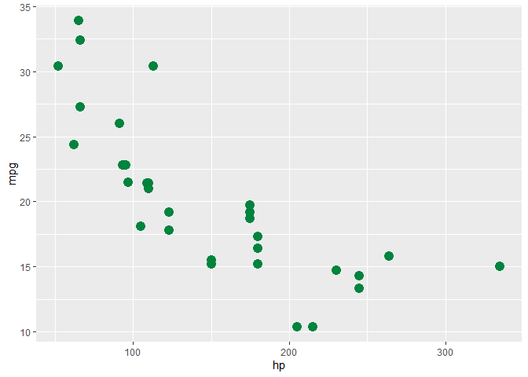
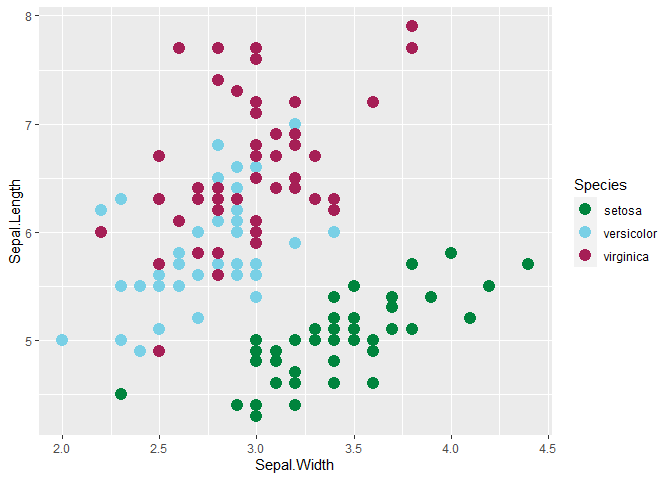
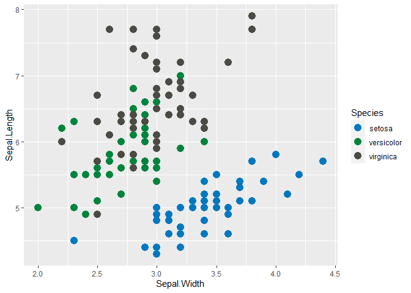
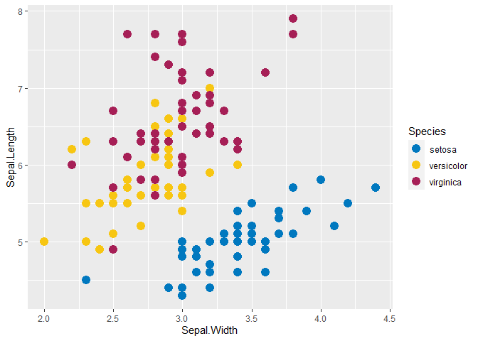
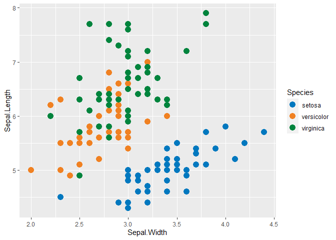
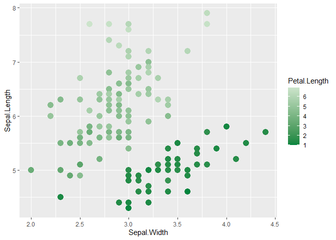

<!-- README.md is generated from README.Rmd. Please edit that file -->

# qhsR

<!-- badges: start -->
<!-- badges: end -->

The goal of qhsR is to provide a home for miscellaneous R functions that
are useful to the CCF QHS department but do not warrant a standalone
package.

## Installation

You can install the development version of qhsR from
[GitHub](https://github.com/) with:

``` r
# install.packages("devtools")
devtools::install_github("ClevelandClinicQHS/qhsR")
```

Details of the included functionality follow.

------------------------------------------------------------------------

## CCF color palette

The `ccf_color_palette` functions provides users with easy access to CCF
brand colors for use in plotting with `ggplot2` or base R plotting.

The code behind this color palette is largely based on the code from the
Wes Anderson color palettes for R:
<https://github.com/karthik/wesanderson> and a previous brand color
palette I created at Memorial Sloan Kettering Cancer Center.

``` r
library(ggplot2)
library(qhsR)
```

### The colors

Details about the CCF brand colors can be found at the [OnBrand
website](https://onbrand.clevelandclinic.org/get-the-basics/#color-palette).

On a basic level, the CCF brand colors are stored as named values. You
can see a complete list:

``` r
ccf_cols()
#>         ccf_blue        ccf_green        ccf_black            tango 
#>        "#0078bf"        "#00843d"        "#4b4b45"        "#f08122" 
#>     honey_flower     maroon_flush lightning_yellow        blue_haze 
#>        "#5c2161"        "#a61f56"        "#f7c612"        "#bdbbd4" 
#>       candy_corn           wattle          seagull        mauvelous 
#>        "#fdf061"        "#d5e048"        "#79d0e6"        "#ee93ae" 
#>         flamingo      beryl_green       cinderella             lola 
#>        "#ef413d"        "#dedab7"        "#fcdcda"        "#e2d4d9" 
#>       surf_crest    light_apricot       botticelli      silver_sand 
#>        "#cce4cb"        "#fdd1b0"        "#d3dee8"        "#c6c8c8" 
#>            jumbo pickled_bluewood        millbrook            mondo 
#>        "#7b7d83"        "#384d5f"        "#51362d"        "#473f29"
```

You can access the hex color for a specific color:

``` r
ccf_cols("ccf_green")
#> [1] "#00843d"
```

You can access the hex color for multiple colors:

``` r
ccf_cols("ccf_blue", "ccf_green")
#> [1] "#0078bf" "#00843d"
```

### Palettes

There are seven color palettes available. Note that these color palettes
focus on using the CCF brand colors, and not on being color-blind
friendly. Color combinations should be tested for color-blind
accessibility as needed.

You can view a list of the color names and hex codes for a specific
color palette:

``` r
ccf_palettes[["main"]]
#> [1] "#0078bf" "#00843d" "#4b4b45" "#f08122" "#5c2161" "#a61f56" "#f7c612"
```

And you can also view the colors in a plot window.

#### main

The `main` color palette is based on the primary and secondary CCF brand
colors.

``` r
ccf_palette("main")
```


#### bright

The `bright` color palette is based on the bright supplemental CCF brand
colors.

``` r
ccf_palette("bright")
```


#### contrast

The `contrast` color palette mixes colors from `main` and `bright` in an
order that should allow some distinction when plotting.

``` r
ccf_palette("contrast")
```


#### neutral

The `neutral` color palette is based on the neutral supplemental CCF
brand colors.

``` r
ccf_palette("neutral")
```


#### all

The `all` color palette contains all colors from main, bright, and
neutral for when a large number of colors are needed.

``` r
ccf_palette("all")
```


#### blues

The `blues` color palette only contains two colors and is meant to be
used for continuous color scales where interpolation will be done
between the high and low color.

``` r
ccf_palette("blues")
```


#### greens

Similarly, the `greens` color palette only contains two colors and is
meant to be used for continuous color scales where interpolation will be
done between the high and low color.

``` r
ccf_palette("greens")
```


### Plotting

Functionality is available to plot single or multiple colors, discrete
color scales, and continuous color scales.

To use a single specific color, simply reference it by name.

``` r
ggplot(mtcars, aes(x = hp, y = mpg)) +
  geom_point(size = 4, color = ccf_cols("ccf_green"))
```



You can do the same to use multiple specific colors by name using
`scale_color_manual`.

``` r
ggplot(iris, aes(Sepal.Width, Sepal.Length, color = Species)) +
  geom_point(size = 4) +
  scale_color_manual(
    values = ccf_cols(c("ccf_green", "seagull", "maroon_flush"))
    )
```



To use the palettes, specify a palette by name as the `values` argument
to `scale_color_manual` or `scale_fill_manual`.

``` r
ggplot(iris, aes(Sepal.Width, Sepal.Length, color = Species)) +
  geom_point(size = 4) +
  scale_color_manual(values = ccf_palette("main"))
```



``` r
ggplot(iris, aes(Sepal.Width, Sepal.Length, color = Species)) +
  geom_point(size = 4) +
  scale_color_manual(values = ccf_palette("contrast"))
```



You can also pick and choose which colors you want by position in the
palette.

``` r
ggplot(iris, aes(Sepal.Width, Sepal.Length, color = Species)) +
  geom_point(size = 4) +
  scale_color_manual(values = ccf_palette("main")[c(1, 4, 2)])
```



The `scale_color_gradientn` function can be used to add colors on a
continuous scale, by adding the option `type = "continuous"` to
`ccf_palette()`. Interpolation between colors in the palette will be
done to create a continuous scale, and this is intended for use with the
`blues` and `greens` palettes.

``` r
ggplot(iris, aes(Sepal.Width, Sepal.Length, color = Petal.Length)) +
  geom_point(size = 4) +
  scale_color_gradientn(colors = ccf_palette("greens", type = "continuous"))
```



### Setting the default color palette

You can set a default color palette for all plotting with {ggplot2} in a
session using `set_ccf_palette()`. By default it will set the palette to
“all”, but any of the palettes can be selected, or specific colors can
be specified. This will add custom versions of `scale_color_discrete`
and `scale_fill_disrete` to the global environment, and will impact all
following plotting that use color or fill.

``` r
set_ccf_palette("contrast")
#> <environment: R_GlobalEnv>

ggplot(iris, aes(Sepal.Width, Sepal.Length, color = Species)) +
  geom_point(size = 4) 
```


------------------------------------------------------------------------
